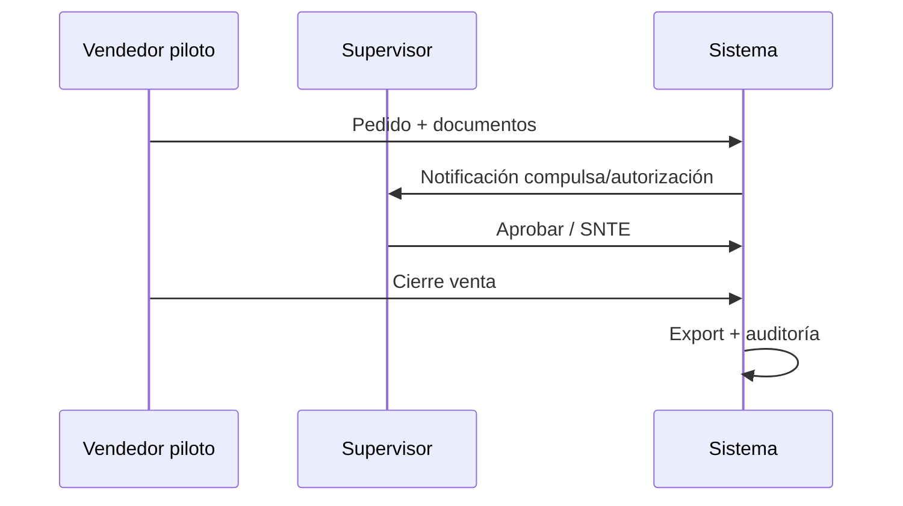

# P84 — Pilot production execution

Ejecución del piloto con **1 vendedor** (extiende P80).

## Flujo piloto (1 vendedor)

## Métricas a capturar

| Métrica | Fuente | Meta semanal |
|---------|--------|--------------|
| Tiempo pedido → autorización | case_events | < SLA interno |
| Errores 500 web | logs nginx/web | 0 críticos |
| Rechazos | estados caso | Documentados |
| Uploads fallidos | `upload_status` FAILED | < 5% |
| Casos pendientes | dashboard | Tendencia ↓ |

## Logging piloto

- Etiquetar logs con `ENVIRONMENT=staging` o `production`
- Filtrar por `seller_name` del vendedor piloto
- Revisar `audit_entries` acciones denegadas (P81)
- Exportar muestra CSV compliance si necesario

## Checklist diaria (operaciones)

- [ ] Vendedor piloto puede login
- [ ] ≥1 caso avanzó en workflow
- [ ] Sin bloqueo RBAC inesperado
- [ ] Telegram respondió en horario laboral
- [ ] Backup del día
- [ ] `/health` 200

## Rollback de emergencia

1. Pausar usuario piloto (desactivar en `users.is_active`)
2. Comunicar canal alterno (Excel manual temporal)
3. Deploy versión anterior (P72 `git_ref`)
4. Restore BD si corrupción (P77)
5. Post-mortem en 24h

## Criterios fin de piloto

- Métricas en meta P80
- Capacitación P83 completada
- Go para rollout P85

## Referencias

- `docs/P80_PILOT_PRODUCTION_PLAN.md`
- `docs/P82_REAL_DATA_QA.md`
